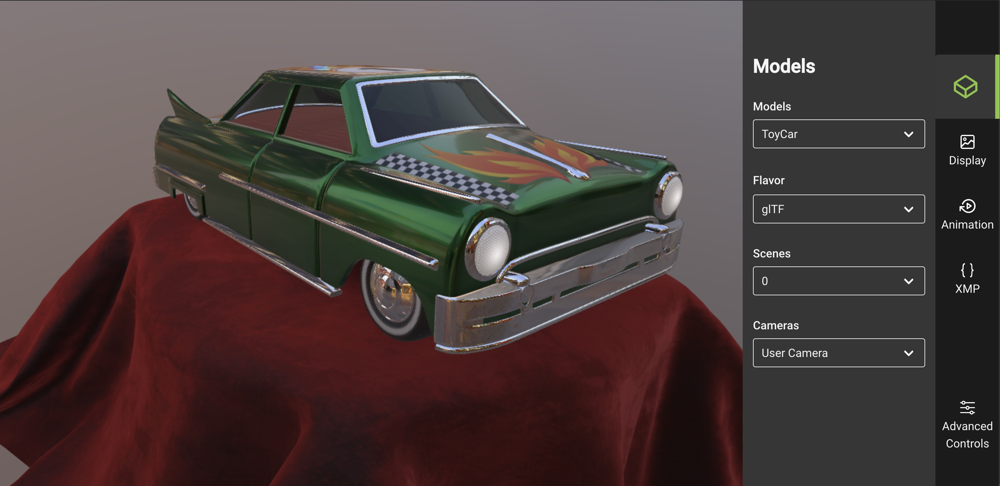

Khronos glTF 2.0 Sample Viewer
==============================

[](https://github.khronos.org/glTF-Sample-Viewer-Release/)

This is the official [Khronos glTF 2.0](https://www.khronos.org/gltf/) Sample Viewer using [WebGL](https://www.khronos.org/webgl/): [glTF 2.0 Sample Viewer](https://github.khronos.org/glTF-Sample-Viewer-Release/)


Table of Contents
-----------------

- [Version](#version)
- [Credits](#credits)
- [Features](#features)
- [Setup](#setup)
- [API](#api)
- [Web App](#web-app)
- [Physically-Based Materials in glTF 2.0](#physically-based-materials-in-gltf-20)

Version
-------

Development for PBR next phase one

Credits
-------

Refactored and developed by [UX3D](https://www.ux3d.io/). Supported by the [Khronos Group](https://www.khronos.org/) and by [Google](https://www.google.com/) for the glTF Draco mesh compression import.
Original code based on the former [glTF-WebGL-PBR](https://github.com/KhronosGroup/glTF-Sample-Viewer/tree/glTF-WebGL-PBR) project. Previously supported by [Facebook](https://www.facebook.com/) for animations, skinning and morphing.

Features
--------

- [x] glTF 2.0
- [x] [KHR_draco_mesh_compression](https://github.com/KhronosGroup/glTF/tree/main/extensions/2.0/Khronos/KHR_draco_mesh_compression)
- [x] [KHR_lights_punctual](https://github.com/KhronosGroup/glTF/tree/main/extensions/2.0/Khronos/KHR_lights_punctual)
- [x] [KHR_materials_clearcoat](https://github.com/KhronosGroup/glTF/tree/main/extensions/2.0/Khronos/KHR_materials_clearcoat)
- [x] [KHR_materials_emissive_strength](https://github.com/KhronosGroup/glTF/tree/KHR_materials_emissive_strength/extensions/2.0/Khronos/KHR_materials_emissive_strength)
- [x] [KHR_materials_pbrSpecularGlossiness](https://github.com/KhronosGroup/glTF/tree/main/extensions/2.0/Khronos/KHR_materials_pbrSpecularGlossiness)
- [x] [KHR_materials_ior](https://github.com/KhronosGroup/glTF/tree/main/extensions/2.0/Khronos/KHR_materials_ior)
- [x] [KHR_materials_sheen](https://github.com/KhronosGroup/glTF/tree/main/extensions/2.0/Khronos/KHR_materials_sheen)
- [x] [KHR_materials_specular](https://github.com/KhronosGroup/glTF/tree/main/extensions/2.0/Khronos/KHR_materials_specular)
- [x] [KHR_materials_transmission](https://github.com/KhronosGroup/glTF/tree/main/extensions/2.0/Khronos/KHR_materials_transmission)
- [x] [KHR_materials_unlit](https://github.com/KhronosGroup/glTF/tree/main/extensions/2.0/Khronos/KHR_materials_unlit)
- [x] [KHR_materials_variants](https://github.com/KhronosGroup/glTF/tree/main/extensions/2.0/Khronos/KHR_materials_variants)
- [x] [KHR_materials_volume](https://github.com/KhronosGroup/glTF/tree/main/extensions/2.0/Khronos/KHR_materials_volume)
- [x] [KHR_materials_iridescence](https://github.com/KhronosGroup/glTF/tree/main/extensions/2.0/Khronos/KHR_materials_iridescence)
- [x] [KHR_mesh_quantization](https://github.com/KhronosGroup/glTF/tree/main/extensions/2.0/Khronos/KHR_mesh_quantization)
- [x] [KHR_texture_basisu](https://github.com/KhronosGroup/glTF/tree/main/extensions/2.0/Khronos/KHR_texture_basisu)
- [x] [KHR_texture_transform](https://github.com/KhronosGroup/glTF/tree/main/extensions/2.0/Khronos/KHR_texture_transform)
- [x] [KHR_xmp_json_ld](https://github.com/KhronosGroup/glTF/pull/1893)


Setup
-----

For local usage and debugging, please follow these instructions:

0. Make sure [Git LFS](https://git-lfs.github.com) is installed.

1. Checkout the [`main`](../../tree/main) branch

2. Pull the submodules for the required [glTF sample models](https://github.com/KhronosGroup/glTF-Sample-Models) and [environments](https://github.com/KhronosGroup/glTF-Sample-Environments) `git submodule update  --init --recursive`

3. To build the npm package for publishing:
	- run `npm install`
	- run `npm run build`

This will create a new `gltf-viewer.js` and `gltf-viewer.module.js` in the `dist` directory.

API
----

glTF Sample Viewer can be used without the web app, for example for integration into a thirdparty web application or for automated testing (see [Render Fidelity Tools](#render-fidelity-tools)).

The API consists of several components that in combination allow flexible configuration of the gltf viewer.

More detailed information about the API is listed in the [api documentation](API.md).

### GltfView

The GltfView component is associated with one WebGL2 context. In practice this means it will be associated with one HTML5 Canvas. This component manages the interaction between the canvas and the GL context. For example it therefore specifies the viewport, the swapchain and can be used to schedule frame renders. 

```js
const view = new GltfView(webGl2Context);
```

The view is also used to render frames, either on every window repaint event or on demand, e.g. when taking a frame capture.

```js
const update = () =>
{
    view.renderFrame(state, canvas.width, canvas.height);
    window.requestAnimationFrame(update);
};
window.requestAnimationFrame(update);
```

### GltfState

The GltfState encapsulates the state of the content of a GltfView. *As currently some WebGL resources are stored directly in the Gltf objects, the state cannot be shared between views.*

```js
const state = view.createState();
state.sceneIndex = 0;
state.animationIndices = [0, 1, 2];
state.animationTimer.start();
```

The state is passed to the `view.renderFrame` function to specify the content that should be renderered.

### ResourceLoader

ResourceLoader can be used to load external resources and make them available to the renderer.

```js
state.gltf = await resourceLoader.loadGltf("path/to/some.gltf");
```

Web App
-------

You can find an example application for the gltf viewer in the [app_web subdirectory of the sample viewer repository](app_web). A live demo can be found at [https://github.khronos.org/glTF-Sample-Viewer-Release/](https://github.khronos.org/glTF-Sample-Viewer-Release/).

**Running a local version**

Open a terminal window in the repository root an run the following commands
```
cd app_web
npm install 
npm run dev
```

now you can access glTF Sample Viewer with Chrome or Firefox at the URL [`http://localhost:8000`](http://localhost:8000)

Render Fidelity Tools
-----------------------------
The gltf sample viewer is integrated into Google's [render fidelity tools](https://github.com/google/model-viewer/tree/master/packages/render-fidelity-tools). This makes it possible to compare different renderers. To run the render fidelity tools follow the instructions [here](https://github.com/google/model-viewer/blob/master/README.md) and [here](https://github.com/google/model-viewer/blob/master/packages/render-fidelity-tools/README.md). For information on how the gltf sample viewer was integrated see the [pull request on github](https://github.com/google/model-viewer/pull/1962).

Physically-Based Materials in glTF 2.0
--------------------------------------

With the change from glTF 1.0 to glTF 2.0, one of the largest changes included core support for materials that could be used for physically-based shading. Part of this process involved choosing technically accurate, yet user-friendly, parameters for which developers and artists could use intuitively. This resulted in the introduction of the **Metallic-Roughness Material** to glTF. If you would like to read more about glTF, you can find the content at its [GitHub page](https://github.com/KhronosGroup/glTF).

A good reference about Physically-Based Materials and its workflow can be found on the [THE PBR GUIDE - PART 1](https://academy.allegorithmic.com/courses/the-pbr-guide-part-1) and [THE PBR GUIDE - PART 2](https://academy.allegorithmic.com/courses/the-pbr-guide-part-2) from [allegorithmic](https://www.allegorithmic.com).

For implementation details and further theory, please find more information in the [Real Shading in Unreal Engine 4](https://blog.selfshadow.com/publications/s2013-shading-course/) presentation from the SIGGRAPH 2013 course.
