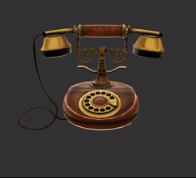
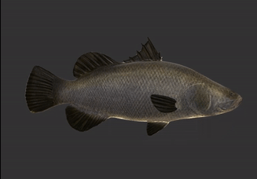

Physically-Based Rendering in glTF 2.0 using WebGL - Senior Design Project
==============================================


This is a raw WebGL demo application for the introduction of physically-based materials to the core glTF 2.0 spec. This project is meant to be a barebones reference for developers looking to explore the widespread and robust capabilities of these materials within a WebGL project that isn't tied to any external graphics libraries. 

If you would like to see the demo in action, feel free to visit it [here](https://www.seas.upenn.edu/~moneimne/WebGL-PBR/)!
> **Controls**
>
> `click + drag` : Rotate model
> 
> `scroll` : Zoom camera
> 
> `GUI` : Use to change models

Last updated: February 25, 2017

Physically-Based Materials in glTF 2.0
--------------------------------------

With the change from glTF 1.0 to glTF 2.0, one of the largest changes included core support for materials that could be used for physically-based shading. Part of this process involved chosing technically accurate, yet user-friendly, parameters for which developers and artists could use intuitively. This resulted in the introduction of the **Metallic-Roughness Material** to glTF. If you would like to read more about glTF, you can find the content at its [GitHub page](https://github.com/KhronosGroup/glTF), but I will take a bit of time to explain how this new material works. 

A surface using the Metallic-Roughness material is governed by three parameters: 
* `baseColor` - The inherent color attribute of a surface
* `metallic` -  A float describing how metallic the surface is
* `roughness` - A float describing how rough the surface is

These parameters can be provided to the material in two ways. Either the parameters can be given constant values, which would dictate the shading of an entire mesh uniformly, or textures can be provided that map varying values over a mesh. In this project, all of the glTF files followed the latter case. It is important to note here that although `metallic` and `roughness` are separate parameters, they are provided as a single texture in which the `metallic` values are in the red channel and the `roughness` values are in the blue channel to save on space.

**Base Color of a Boombox**

 -> 

**Metallic-Roughness of a Boombox**

 -> 

Although these are the core parameters of the Metallic-Roughness material, often a user will want to provide additional maps for features such as normals, ambient occlusion, or emissiveness. Similarly to above, these are usually provided as a texture that corresponds to the parts of the mesh that have shifted normals, are occluded and/or are emissive, respectively. However, since these are not a part of the Metallic-Roughness material itself, they are provided as a separate portion to the material.

The overall structure of a material would then look something like this in glTF 2.0:

```
"materials": [
  {
    "pbrMetallicRoughness": {
      "baseColorTexture": {...},
      "metallicRoughnessTexture": {...}
    },
    "normalTexture": {...},
    "occlusionTexture": {...},
    "anyOtherAttribute": {...},
    "name": "myMetallicRoughnessMaterial"
  }
]
```
Using Metallic-Roughness to Shade
----------------------------------

Once we have read in these values and passed them into the fragment shader correctly, we need to compute the final color of each fragment. Without going too far into the theory behind PBR, this is how this demo application computes the color. 

It is first important to choose a microfacet model to describe how light interacts with a surface. In this project, I use the [Cook-Torrance Model](https://renderman.pixar.com/view/cook-torrance-shader) to compute lighting. However, there is a large difference between doing this based on lights within a scene versus an environment map. With discrete lights, we could just evaluate the BRDF with respect to each light and average the results to obtain the overall color, but this is not ideal if you want a scene to have complex lighting that comes from many sources.

###Environment Maps

This is where environment maps come in! Environement maps can be thought of as a light source that surrounds the entire scene (usually as an encompassing cube or sphere) and contributes to the lighting based on the color and brightness across the entire image. As you might guess, it is extremely inefficient to assess the light contribution to a single point on a surface from every visible point on the environment map. In offline applications, we would typically resort to using importance sampling within the render and just choose a predefined number of samples. However, as described in [Unreal Engine's course notes on real-time PBR](http://blog.selfshadow.com/publications/s2013-shading-course/karis/s2013_pbs_epic_notes_v2.pdf), we can reduce this to a single texture lookup by baking the diffuse and specular irradiance contributions of the environment map into textures. You could do this youself as described in the course notes, but there is also a resource called [IBL Baker](http://www.derkreature.com/iblbaker/) that will create these textures for you. The diffuse irradiance can be stored in a cube map, however, we expect the sharpness of specular reflection to diminish as the roughness of the object increases. Because of this, the different amounts of specular irradiance can be stored in the mip levels of the specular cube map and accessed in the fragment shader based on roughness.

**Diffuse Front Face**


**Specular Front Face**

         

###BRDF
At this point, we are able to pick out the diffuse and specular incoming light from our environment map, but we still need to evaluate the BRDF at this point. Instead of doing this computation explicitly, we use a BRDF lookup table to find the BRDF value based on roughness and the viewing angle. It is important to note that this lookup table changes depending on which microfacet model we use! Since this project uses the Cook-Torrance model, we use the following texture in which the y-axis corresponds to the roughness and the x-axis corresponds to the dot product between the surface normal and viewing vector.


###Diffuse and Specular Color
We now have the diffuse and specular incoming light and the BRDF, but we need to use all the information we have gathered thus far to actually compute the lighting. Here is where the `metallic` and `baseColor` values come into play. Although the `baseColor` dictates the inherent color of a point on a surface, the `metallic` value tells us how much of the `baseColor` is represented in the final color as diffuse versus specular. For the diffuse color, we do this by interpolating between black and the base color based on the `metallic` value such that the diffuse color is closer to black the more metallic it is. Conversely, for the specular color, we interpolate such that the surface holds more of the `baseColor` the more metallic it is.

###Final Color
Finally, we can compute the final color by summing the contributions of diffuse and specular components the color in the following manner:

`finalColor = (diffuseLight + diffuseColor) + (specularLight * (specularColor * brdf.x + brdf.y))`

Some Results
------------

Here are some resulting renders from the demo application.

**Telephone Model**



**BarramundiFish Model**


