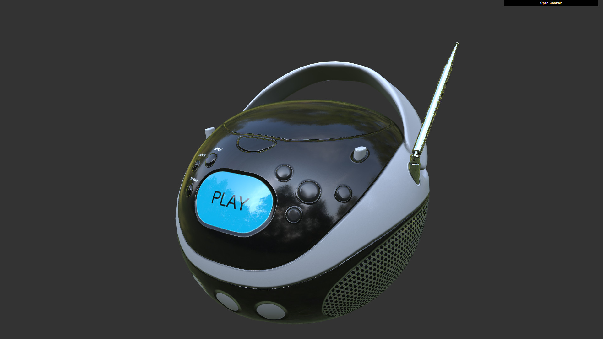

glTF Sample Viewer Web App
==============================

This is the official [Khronos glTF 2.0](https://www.khronos.org/gltf/) Sample Viewer using [WebGL](https://www.khronos.org/webgl/): [glTF 2.0 Sample Viewer](https://github.khronos.org/glTF-Sample-Viewer-Release/)

Viewer
======

Link to the live [glTF 2.0 Sample Viewer](https://github.khronos.org/glTF-Sample-Viewer-Release/).

Usage
-----

### Controls

`click + drag` : Rotate model

`scroll` : Zoom camera

`GUI` : Use to change models and settings

### Change glTF model

* Choose one of the glTF models in the selection list
* Drag and drop glTF files into viewer

### Change the environment map
* Drag and drop a .hdr panorama file

Setup
-----

For local usage and debugging, please follow these instructions:

0. Make sure [Git LFS](https://git-lfs.github.com) is installed.

1. Checkout the [`master`](../../tree/master) branch

2. Pull the submodules for the required [glTF sample models](https://github.com/KhronosGroup/glTF-Sample-Models) and [environments](https://github.com/KhronosGroup/glTF-Sample-Environments) `git submodule update  --init --recursive`

3. Build the web app
	- `cd app_web`
	- run `npm install`
	- start a demo in the browser with `npm run dev`, and open http://localhost:8000.

When making changes, the project is automatically rebuilt and the `app_web/dist/` directory is populated with the web app. This directory contains all files necessary for deployment to a webserver.

Debugging
---------

* Requirements
  * [Visual Studio Code](https://code.visualstudio.com/) or [vscodium](https://github.com/VSCodium/vscodium)
  * [Chrome](https://www.google.com/chrome/) or [Firefox](https://www.mozilla.org/en-US/firefox/new/)
* Install the [Debugger for Chrome](https://marketplace.visualstudio.com/items?itemName=msjsdiag.debugger-for-chrome) or [Debugger for Firefox](https://marketplace.visualstudio.com/items?itemName=hbenl.vscode-firefox-debug) extension for Visual Studio Code
* Open the project directory in Visual Studio Code and select `Debug->Add Configuration->Chrome` or `Debug->Add Configuration->Firefox` so the `.vscode/launch.json` file is created.
* Append `/app_web/dist` to `${workspaceFolder}` in the `launch.json` file
* `Debug->Start Debugging` should now launch a Chrome or Firefox window with the sample viewer and VS Code breakpoints should be hit.