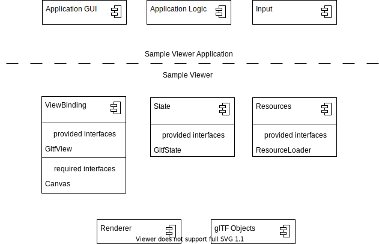
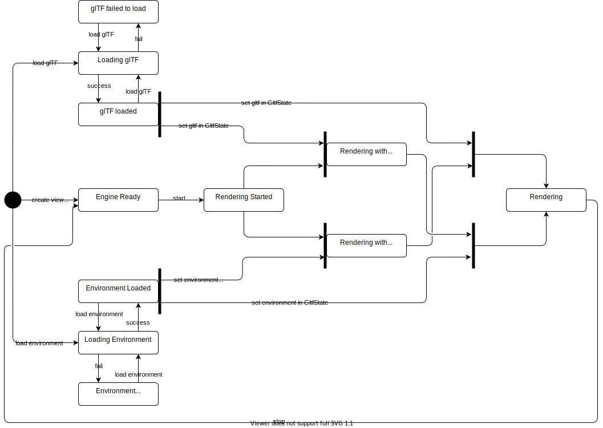

# Proposal for a new glTF-Sample-Viewer API and Design

The main goal of refactoring the glTF-Sample-Viewer API is to make it compatible with NodeJS by removing the strong dependency on the HTML user interface. Furthermore, it should be possible to load resources asynchroneously and independently from each other, thus avoiding a full reload of the sample viewer when one of the resources is changed.

Our proposal aims to separate the current interface into smaller components that can be called and used individually while keeping the underlying functionality intact.

## Components

The current `GltfViewer` object combines resource loading, render loop execution, UI binding and state management in one class. In the proposed API these responsibilities are separated into their own respective modules. 

### GltfView

The GltfView component is associated with one WebGL2 context. In practice this means it will be associated with one HTML5 Canvas. This component manages the interaction between the canvas and the GL context. For example it therefore specifies the viewport, the swapchain and can be used to schedule frame renders. 

```js
const view = new GltfView(canvas);
```

One could also create a headless view with code like the following. *Note that the signature might change in the final API*

```js
const view = new GltfView(hedlessGlContext);
```

The view is also used to render frames, either on every window repaint event or on demand, e.g. when taking a frame capture.

```js
const finished = view.startRendering(state);
```

```js
const buffer = await view.renderToBuffer(state);
```

### GltfState

The GltfState is the view model for a GltfView. It is a complete description of the content that should be visible in the GltfView's associated canvas. You could create multiple states for one view and swap between them, e.g. when a resource is done loading. *As currently some WebGL resources are stored directly in the Gltf objects, the state cannot be shared between views.*

```js
const state = view.createState();
state.activeScene = 0;
state.activeAnimations = [0, 1, 2];
state.renderingOptions = { useIbl: false };
```

### ResourceLoader

As the name implies, ResourceLoader can be used to load external resources and make them available to the renderer. Loading is done asynchronously and results in reusable objects. 

```js
state.gltf = await ResourceLoader.loadGltf("path/to/some.gltf");
```

One can also directly load some resources to WebGL2 memory by providing the context. 

```js
state.environment = await ResourceLoader.loadEnvironment("path/to/environment.hdr", view.context);
```

IBL environments can be loaded and sampled as with the above functionality, or they can be loaded from pre-filtered images as with the following example.

```js
state.environment = await ResourceLoader.loadEnvironmentPrefiltered("path/to/environments", view.context);
```

### User interface

The user interface is now fully separate from the other components of the sample viewer. This means that it is an optional component and applications that want to use the sample viewer with their own UI can do so. For reference, convenience and to provide a standalone application a simple UI is provided together with the core functionality of Gltf Sample Viewer. In the standalone application the UI is bound to the viewer with RxJS and Angular, Vue or React. For example the UI element to select the active scene could be bound to the GltfState with code similar to the following

```js
const ui = new GltfSV.UI(htmlUIElement);
ui.activeScene.subscribe( (scene) => state.activeScene = scene);

``` 

[UI design proposal](documents/UI_proposal.pdf)


## Full Example

```js
// Engine manages the WebGL context, rendering control flow and rendering threads
const view = new GltfSV.GltfView(canvas);

// GltfState holds all state associated with one view of a gltf model
// you could have multiple of these if you want to e.g. one shows a debug
// output channel view and another the default shaded view
const state = view.createState();

// we can also provide helpers that are not required for core functionality
const input = new GltfSV.Input(canvas, document);
const userCamera = new GltfSV.UserCamera();
const ui = new GltfSV.UI(htmlUIElement);

GltfSV.ResourceLoader.loadGltf("path/to.gltf").then( (gltf) => {
    state.gltf = gltf; 
    return gltf;
});

// load the environment and keep it in a variable for reuse
// the texture data already lies in WebGL
environment = GltfSV.ResourceLoader.loadEnvironment("path/to/environment.hdr", view.context).then( (environment) => {
    state.environment = environment
    return environment;
});

// you can immediately set parameters of the gltf state
// but usually we would leave the defaults in place
state.activeCamera = userCamera;
state.activeScene = 0;
state.activeAnimations = [0, 1, 2];

// start rendering in its own thread, respecting changes to the state. Alternatively
// one could schedule frames manually with something like `view.render(state)`
const finished = view.startRendering(state);

// User interface

// connect the input to the user camera (this could be hidden)
input.mouseDelta.subscribe( (delta) => 
    userCamera.orbit = userCamera.orbit + delta
);

// the gltf view parameters can also be connected to the UI with RxJS
ui.activeCamera.subscribe( (camera) => state.activeCamera = camera);
ui.activeScene.subscribe( (scene) => state.activeScene = scene);
// the connections can also contain more complex behaviour like 
// loading an asset while keeping the ui responsive
ui.gltf.subscribe( (gltfUrl) =>
    engine.resources.loadGltf(gltfUrl).then( (gltf) => 
        state.gltf = gltf
    )
);
// connect the capture button and file dialog to the screenshot 
// functionality in the engine, change the active camera and write 
// the rendered image, all non blocking
ui.capture.subscribe( (fileUri) => 
    {
        // make a copy of the view and modify it for the rendering
        const captureState = { 
            ...state  // make a shallow copy
            activeCamera = null; // and set the camera to be the gltf's default
            options.debugMode = null; // set to default shaded
        };

        view.renderToBuffer(captureState).then( (buffer) => 
            buffer.writeToFile(fileUri)
        )
    }
);

// wait for the engine to stop
await finished;


```

## Component diagram (simplified)


## State diagram (simplified)



# Test Suite Integration

With the proposed changes to the API, an integration into the Google Render Fidelity Comparison Tool would be achievable like in the following example.

```js
private async[$updateScenario](scenario: ScenarioConfig) {
    if (this[$view] == null) {
        this[$canvas] = this.shadowRoot!.querySelector('canvas');
        this[$view] = new GltfSV.GltfView(this[$canvas]);
        this[$state] = this[$view].createState();
    }
    this[$updateSize]();
        
    this[$state].gltf = await GltfSV.ResourceLoader.loadGltf(scenario.model);

    const {orbit, target, verticalFoV, renderSkybox} = scenario;

    this[$state].clearColor = new Color4(0, 0, 0, 0);

    //Setup camera
    this[$state].activeCamera = new GltfSV.UserCamera(
        'Camera',
        alpha,
        beta,
        orbit.radius,
        verticalFoV,
        target);
  
    this[$state].environment = await GltfSV.ResourceLoader.loadEnvironment(scenario.lighting);

    this[$state].renderSkybox = renderSkybox;
    
    this[$state].toneMapping = GltfSV.TONEMAPPING_ACES;      
    
    this[$view].renderFrame([$state]).then(() => {
        requestAnimationFrame(() => {
            this.dispatchEvent(
                //This notifies the framework that the model is visible and the screenshot can be taken
                new CustomEvent('model-visibility', {detail: {visible: true}}));
        });
    });
}
```


