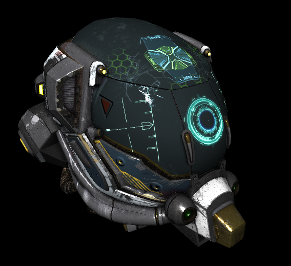
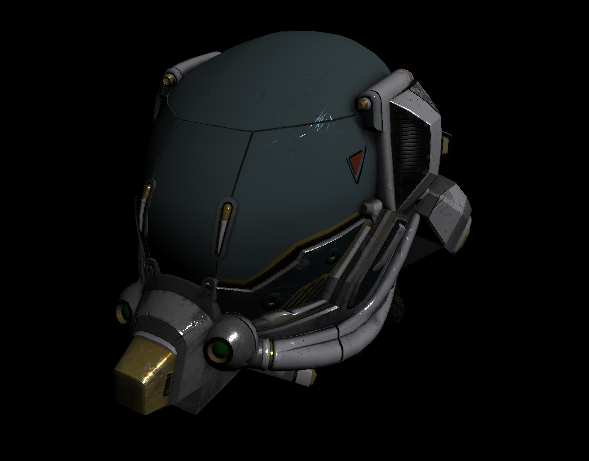

# Battle Damaged Sci-fi Helmet - PBR (modified) 

The original version of this model was created by http://www.leonardocarrion.com/
( https://sketchfab.com/theblueturtle_ ), and published under the Creative 
Commons Attribution-NonCommercial license, at 
https://sketchfab.com/models/b81008d513954189a063ff901f7abfe4

The original glTF version was downloaded from https://sketchfab.com/features/gltf 
(download link: https://gltf.sketchfab.com/models/damagedHelmet.zip )

## Modifications

The following modifications have been made:

- The textures have been flipped vertically
- The "metallic" and "roughness" textures have been combined into 
  a "metallicRoughness" texture
- The `glTF` file was modified:
  - Duplications and transforms of nodes have been removed
  - It does not use any extension, but instead refers to the 
    shaders that contain the basic PBR implementation
  - Other minor cleanups, so that it passes glTF 1.1 validation,
    *except* for the unknown `TANGENT` semantic
- Added basic PBR shaders

## Screenshot

Previous versions: 

  